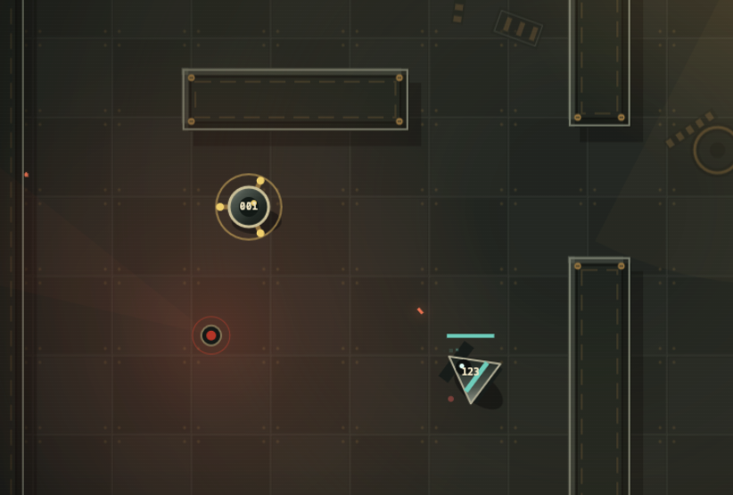

# SolaDroid

SolaDroid is a browser action game about boarding hostile machines and turning their strengths against one another.

You begin aboard the stricken RMS Ceres as Influence Device 001, a quick but fragile machine. Clear each deck by fighting its hostile units or transferring into a stronger chassis, then reach the lift before your borrowed body breaks down. Twenty decks lead inward to the intelligence controlling the ship: Central Command.

The game is written in plain HTML, CSS and JavaScript. It uses Canvas for the game world and Web Audio for its sound, with no dependencies or build step.



## Playing

Each chassis has different movement, armour, weapon and stability ratings. Approach another unit to inspect its capabilities, then commit to a circuit duel if you want to take control of it. Transfers expose every pulse, route and change of ownership: capture five of nine cores before Central Command does.

The field guide introduces the controls during your first game. Early radar guidance marks hostiles and objectives; deeper in the ship, Central Command interferes with that information and turns ordinary cleaning, power and coolant systems against you. Physical warnings remain trustworthy even when the terminals do not.

| Control | Keyboard | Gamepad |
| --- | --- | --- |
| Move | WASD or arrow keys | Left stick |
| Aim | Last movement direction | Right stick |
| Fire | Space | A |
| Interact or transfer | E | X |
| Pause | P or Escape | Start |

## The descent

The campaign is arranged as five four-deck movements. The breached outer decks are cluttered, damaged and washed in emergency red. Containment gives way to pale administration, synchronized systems and finally the still blue order of the core. The visual noise recedes as Central Command becomes more direct—and more unsettling.

The progression takes inspiration from Stephen Gallagher's radio drama [*The Last Rose of Summer*](https://stephengallagher.com/audio/) and the frozen centre of Dante's *Inferno*: a machine intelligence trapped by its own administrative certainty, and a journey that becomes colder and more ordered as it approaches the centre.

## Getting started

You need a modern browser. Serve the files from the project directory with any static web server; Python's built-in server is enough:

```bash
git clone git@github.com:ohnotnow/soladroid.git
cd soladroid
python3 -m http.server 8000
```

Open [http://localhost:8000](http://localhost:8000) and press Enter to begin.

## Checks

There is no compilation step or automated test suite. The JavaScript can be syntax-checked with Node.js:

```bash
node --check game.js
```

## About

SolaDroid is a personal, unofficial homage to Andrew Braybrook's 1985 game [*Paradroid*](https://en.wikipedia.org/wiki/Paradroid).

## Contributing

Fork or clone the repository, make your changes, and run the syntax check above. Keep the project dependency-free unless a change genuinely requires otherwise.

## Licence

SolaDroid is released under the [MIT License](LICENSE).
